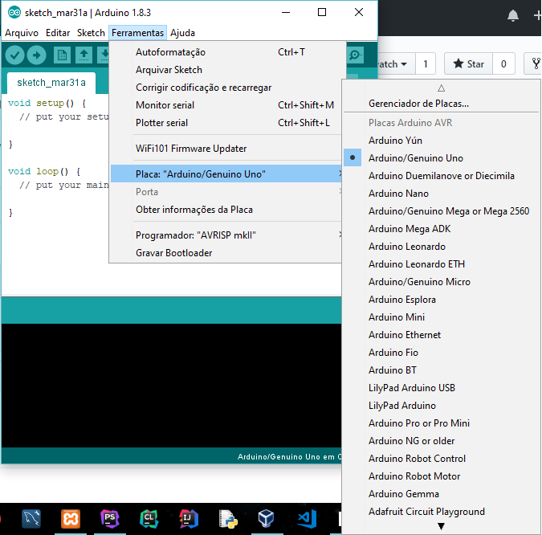

# Arduino
<h2>Passo a passo</h2>
<h3>1º passo:</h3>

Baixar e instalar a Arduino IDE e configurar para a placa a ser usada.

Arduino: <a href="https://www.arduino.cc/en/Main/Software">https://www.arduino.cc/en/Main/Software</a>

Escolha a placa em Ferramentas/Placa.

Em seguida, selecione a porta disponível.

<h3>2º passo</h3>

Baixar e instalar o ambiente de desenvolvimento XAMPP.

<a href="https://www.apachefriends.org/pt_br/download.html">https://www.apachefriends.org/pt_br/download.html</a>
